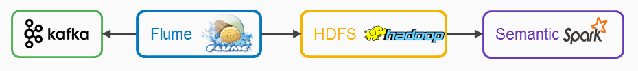

# Spark-semantic

Simple spark architecture to compute batch on hdfs file source.

## Architecture

## Stack

### Flume

Flume will allow to consume data from Kafka and feed a HDFS cluster.

### HDFS

Distribued file system to store all the data our system want to ingest. Allow us to have immutable data , avoiding the data corruption.

### Spark

Spark allow batch to be compute in RAM. It's has best performance with machine learning algorithm.

## Start the project
1. package

Automatic package isn't available for spark. please :

    cd spark && sbt package 

2. You can start the project with
 
    docker-compose up

Then you can feed Kafka with JSON with [DCAT](https://www.w3.org/TR/vocab-dcat/) format 
Note that Dcat is the most common format for open-data. You'll be able to classify your data from your city-API.